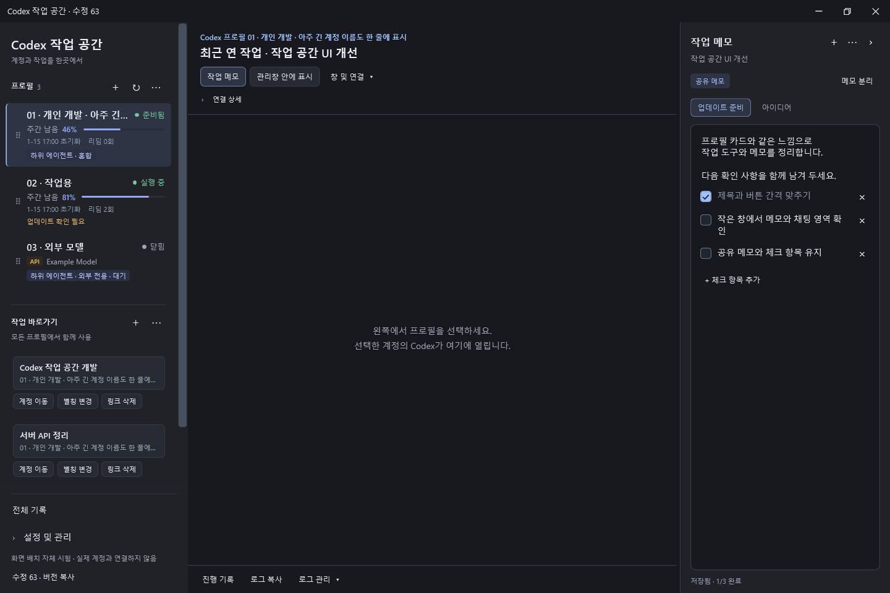
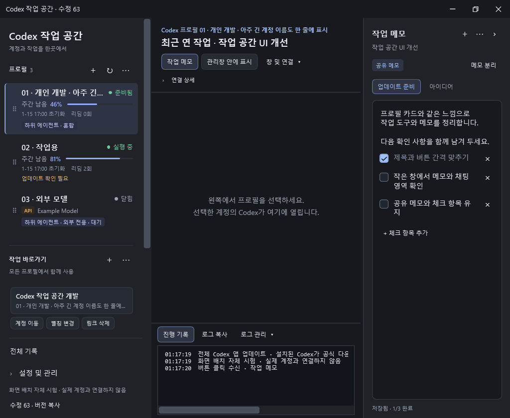
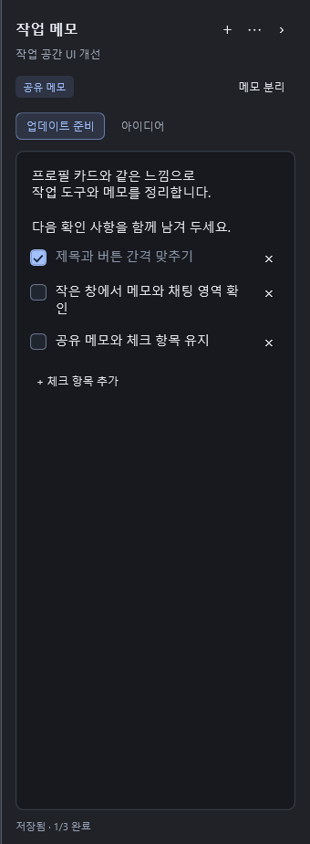

# Workspace chrome — revision 63

Extends the accepted [profile sidebar](../profile-sidebar/README.md) to the task
header, workspace tools, diagnostics and task notes. The images below are rendered
from the real WPF controls with synthetic data, without an attached Codex window.
The empty center is a fixture, not a capture of a user's conversation.

## Layout

- Charcoal surfaces, a restrained blue accent, six-pixel button corners and the
  same title/metadata hierarchy as the profile cards.
- Task identity on the left; task notes, viewport restore and connection tools on
  the right. On smaller workspaces the tools move below the title.
- Notes have aligned add/menu/collapse controls, a sharing badge, explicit note
  separation and a single scrolling tab strip. Text and checklist items remain
  in one document, with save/completion status beneath it.
- Opening or resizing notes reserves at least 420 DIP for the workspace center.
  Closing notes returns that space to Codex. The notes width is capped when the
  manager is resized smaller.
- Log actions share the same compact toolbar treatment. Copy feedback has a full
  tooltip, and the expandable log has a separate darker surface.
- The standard dialog buttons and title-bar controls use the same button theme.

## Actual control previews

## Validation

`--layout-self-test` exercises wide and minimum-size windows, open/close notes,
resizing a wide notes panel into a smaller window, all primary action bounds,
simultaneously opened notes/logs and selection of the last of fourteen note tabs.
It uses an in-memory read-only note response; it cannot open a live profile.

The existing notes self-test covers mixed text/checklists, save recovery, shared
notes, explicit separation and conflicting edits. The manager release build now
runs the layout fixture alongside those checks before promoting a release.
